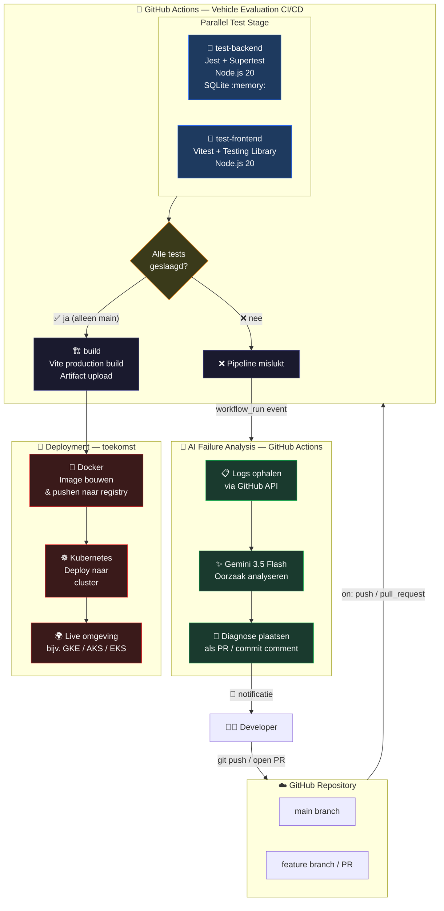

# CI/CD Pipeline Diagram

```mermaid
flowchart TD
    DEV["👨‍💻 Developer"] -->|"git push / open PR"| REPO

    subgraph REPO["☁️ GitHub Repository"]
        direction LR
        MAIN["main branch"]
        PR["feature branch / PR"]
    end

    REPO -->|"on: push / pull_request"| PIPELINE

    subgraph PIPELINE["🔄 GitHub Actions — Vehicle Evaluation CI/CD"]
        direction TB

        subgraph TESTS["Parallel Test Stage"]
            direction LR
            BACKEND["🧪 test-backend\nJest + Supertest\nNode.js 20\nSQLite :memory:"]
            FRONTEND["🧪 test-frontend\nVitest + Testing Library\nNode.js 20"]
        end

        GATE{"Alle tests\ngeslaagd?"}

        BUILD["🏗️ build\nVite production build\nArtifact upload"]
        FAIL["❌ Pipeline mislukt"]
    end

    TESTS --> GATE
    GATE -- "✅ ja (alleen main)" --> BUILD
    GATE -- "❌ nee" --> FAIL

    FAIL -->|"workflow_run event"| AI_PIPELINE

    subgraph AI_PIPELINE["🤖 AI Failure Analysis — GitHub Actions"]
        LOGS["📋 Logs ophalen\nvia GitHub API"]
        GEMINI["✨ Gemini 3.5 Flash\nOorzaak analyseren"]
        COMMENT["💬 Diagnose plaatsen\nals PR / commit comment"]
    end

    LOGS --> GEMINI --> COMMENT
    COMMENT -->|"🔔 notificatie"| DEV

    BUILD --> DOCKER

    subgraph DEPLOY["🚀 Deployment — toekomst"]
        DOCKER["🐳 Docker\nImage bouwen\n& pushen naar registry"]
        K8S["☸️ Kubernetes\nDeploy naar\ncluster"]
        ENV["🌍 Live omgeving\nbijv. GKE / AKS / EKS"]
    end

    DOCKER --> K8S --> ENV

    classDef action fill:#1a1a2e,color:#fff,stroke:#4a4a8a
    classDef test fill:#1e3a5f,color:#fff,stroke:#2563eb
    classDef ai fill:#1a3a2e,color:#fff,stroke:#16a34a
    classDef deploy fill:#3a1a1a,color:#fff,stroke:#dc2626
    classDef gate fill:#3a3a1a,color:#fff,stroke:#d97706

    class BACKEND,FRONTEND test
    class LOGS,GEMINI,COMMENT ai
    class DOCKER,K8S,ENV deploy
    class GATE gate
    class BUILD,FAIL action
```
