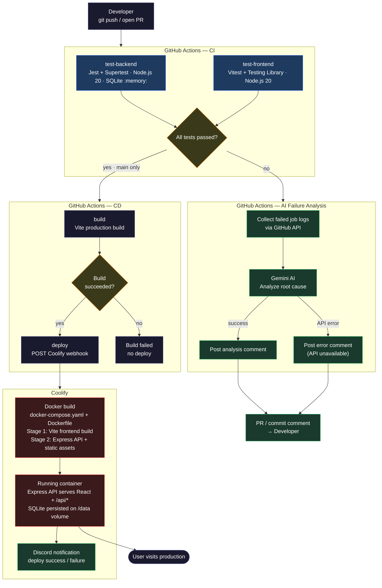

# CI/CD Pipeline Diagram

```mermaid
flowchart TD
    DEV["Developer\ngit push / open PR"]

    DEV --> CI

    subgraph CI["GitHub Actions — CI"]
        direction TB
        BACKEND["test-backend\nJest + Supertest · Node.js 20 · SQLite :memory:"]
        FRONTEND["test-frontend\nVitest + Testing Library · Node.js 20"]
        BACKEND & FRONTEND --> GATE{"All tests passed?"}
    end

    GATE -- "no" --> AI_ANALYSIS
    GATE -- "yes · main only" --> CD

    subgraph CD["GitHub Actions — CD"]
        BUILD["build\nVite production build"]
        BUILD_GATE{"Build\nsucceeded?"}
        DEPLOY["deploy\nPOST Coolify webhook"]
        BUILD_FAILED["Build failed\nno deploy"]
        BUILD --> BUILD_GATE
        BUILD_GATE -- "yes" --> DEPLOY
        BUILD_GATE -- "no" --> BUILD_FAILED
    end

    DEPLOY --> COOLIFY

    subgraph COOLIFY["Coolify"]
        DOCKER_BUILD["Docker build\ndocker-compose.yaml + Dockerfile\nStage 1: Vite frontend build\nStage 2: Express API + static assets"]
        CONTAINER["Running container\nExpress API serves React + /api/*\nSQLite persisted on /data volume"]
        DOCKER_BUILD --> CONTAINER
        CONTAINER --> DISCORD["Discord notification\ndeploy success / failure"]
    end

    CONTAINER --> USER(["User visits production"])

    subgraph AI_ANALYSIS["GitHub Actions — AI Failure Analysis"]
        LOGS["Collect failed job logs\nvia GitHub API"]
        GEMINI["Gemini AI\nAnalyze root cause"]
        POST_OK["Post analysis comment"]
        POST_ERR["Post error comment\n(API unavailable)"]

        LOGS --> GEMINI
        GEMINI -- "success" --> POST_OK
        GEMINI -- "API error" --> POST_ERR
    end

    POST_OK & POST_ERR --> NOTIFY["PR / commit comment\n→ Developer"]

    classDef default fill:#1a1a2e,color:#fff,stroke:#4a4a8a
    classDef test fill:#1e3a5f,color:#fff,stroke:#2563eb
    classDef ai fill:#1a3a2e,color:#fff,stroke:#16a34a
    classDef prod fill:#3a1a1a,color:#fff,stroke:#dc2626
    classDef gate fill:#3a3a1a,color:#fff,stroke:#d97706

    class BACKEND,FRONTEND test
    class LOGS,GEMINI,POST_OK,POST_ERR ai
    class DOCKER_BUILD,CONTAINER prod
    class DISCORD ai
    class GATE,BUILD_GATE gate
    class BUILD_FAILED default
    class NOTIFY ai
```
